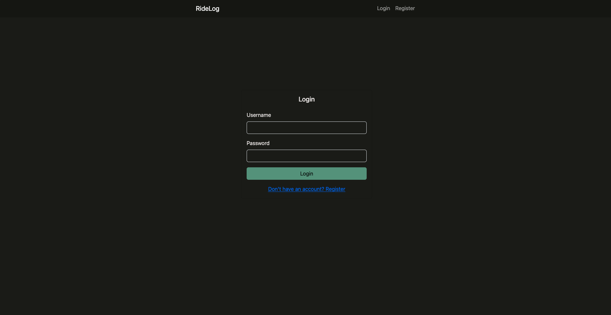
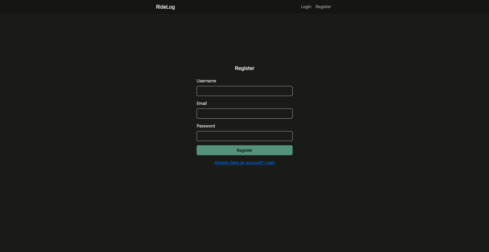
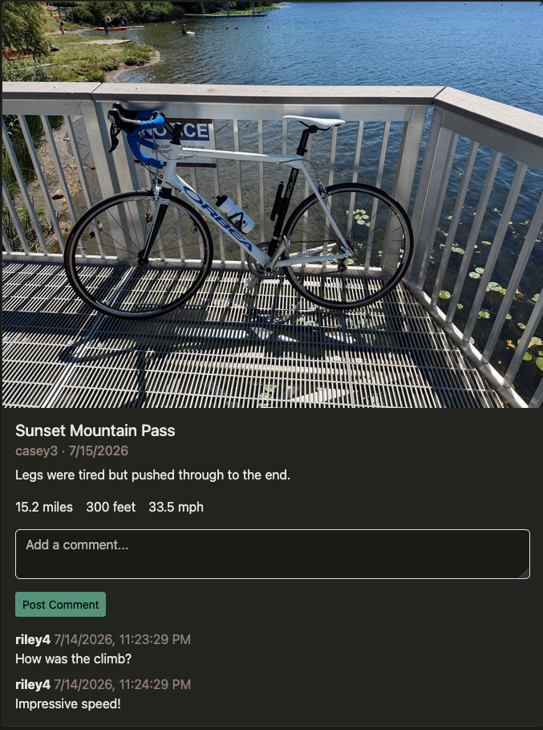
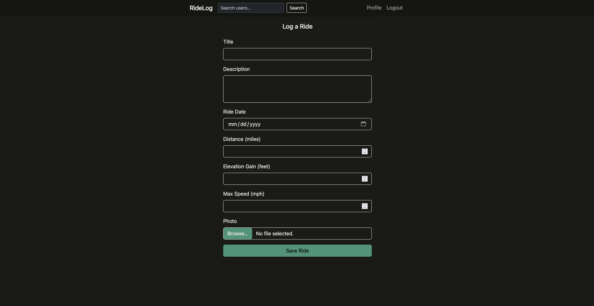
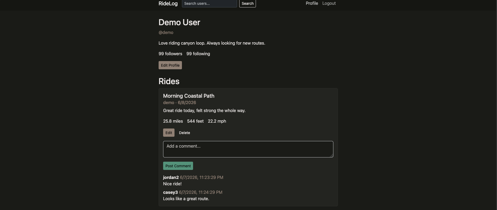
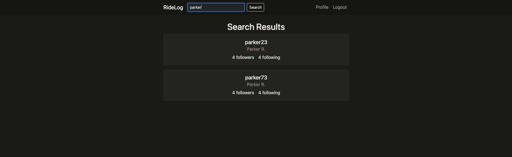

# RideLog

RideLog is a social network for cyclists to record rides and connect with other riders. Users can share ride photos and statistics, follow other users, browse a feed, and leave comments.

## Project Objective

The goal of RideLog is to build a client-side rendered full-stack application using Node.js, Express, MongoDB, and React with Hooks. The application gives cyclists one place to share ride details such as distance, elevation gain, maximum speed, and photos.

## Authors

- Parker McKillop
- Najib Mosquera

**UPDATE:** Add author profile links before submission if they will be included.

## Course

CS 5610 Web Development — [Course website](https://johnguerra.co/classes/webDevelopment_online_summer_2026/)

## Design Documents

[View the project proposal, mockups, and color palette](./design%20docs/)

## Live Website

[https://ridelog-app-528562a37f7f.herokuapp.com/](https://ridelog-app-528562a37f7f.herokuapp.com/login)

## Screenshots

### Login



### Registration



### Ride Feed and Comments



### Log a Ride



### Profile and Ride History



### Rider Search



## Video Demonstration

**UPDATE:** Add the public narrated demonstration video link. Both team members must participate in the video.

## Features

- Register, log in, and log out using Passport session authentication
- Edit a user profile with a display name and bio
- Search for riders by name
- Follow and unfollow other riders
- View ride posts from followed riders in a paginated feed
- View a rider's profile and ride history
- Create, edit, and delete ride posts
- Add a ride photo, date, distance, elevation gain, and maximum speed
- Add comments and delete your own comments
- Restrict post and comment changes to their owners

## Tech Stack

### Frontend

- React with Hooks
- React Router
- React Bootstrap
- Sass
- Fetch API

### Backend

- Node.js
- Express
- Passport
- bcrypt
- MongoDB native Node.js driver
- express-session with connect-mongo

### Image Hosting

- Cloudinary unsigned image uploads

## Local Setup

### Prerequisites

- Node.js 22.12 or newer
- A local MongoDB server or MongoDB Atlas database

### 1. Install dependencies

From the project root:

```bash
npm install
```

The root install script installs the backend and frontend dependencies.

### 2. Configure the backend

Copy the environment-variable example:

```bash
cp backend/.env.example backend/.env
```

Set the following values in `backend/.env`:

```env
MONGO_URI=mongodb://localhost:27017
MONGO_DB_NAME=ridelog
SESSION_SECRET=replace-this-with-a-long-random-value
PORT=3001
```

The frontend development server sends `/api` requests to port `3001`.

### 3. Start the application

From the project root:

```bash
npm run dev
```

This starts the Express backend and Vite frontend. Open the local address printed by Vite in the terminal.

## Seed Data

The seed script creates 100 users, 1,000 ride posts, and 2,000 comments. Run it from the backend directory against the database configured in `backend/.env`:

```bash
cd backend
ALLOW_SEED=true npm run seed
```

To replace existing users, posts, and comments before seeding:

```bash
ALLOW_SEED=true ALLOW_SEED_RESET=true npm run seed
```

The reset command drops the existing `users`, `posts`, and `comments` collections. Use it only on a development or class demonstration database.

The generated demo account is:

- Username: `demo`
- Password: `password1`

## How to Use RideLog

1. Register a new account or log in with the demo account.
2. Search for riders and follow them.
3. Return to the home page to view rides from followed users.
4. Select **Log a Ride** to add a title, description, date, photo, and ride statistics.
5. Visit your profile to view, edit, or delete your rides.
6. Open the comments on a ride to join the conversation or delete your own comments.
7. Use the profile link in the navigation bar to edit your display name or bio.

## Production Build

Build the React frontend from the project root:

```bash
npm run build
```

Start the Express production server:

```bash
npm start
```

In production, Express serves both the API and the compiled React application. Configure `MONGO_URI`, `MONGO_DB_NAME`, `SESSION_SECRET`, `NODE_ENV=production`, and the deployment platform's assigned `PORT`.

## AI Use

### Najib

- Reviewing the codebase to determine what was and wasn't implemented yet for each ticket before starting work
- Debugging the Posts CRUD backend, plus the minimal Passport/session auth needed to unblock it
- Debugging the paginated ride feed endpoint and its supporting MongoDB index
- Debugging the comments API — nested routes, validation, and cascade-delete of comments when a post is deleted
- Debugging the `RideForm`, `PostCard`, and `CommentForm`/`CommentList` React components
- Debugging a git merge conflict in `backend/server.js` between two feature branches

### Parker

I used Claude Code and OpenAI Codex as development tools throughout this project. I primarily used Claude Code at a function-by-function level to help translate logic I had already planned into working syntax. I reviewed the generated code, requested changes when it did not match my intended behavior, and worked through each module and route individually.

I used Codex rubric-based code reviews, testing frontend and backend functionality, and helping with documentation and final cleanup. AI assistance was also used to diagnose errors and suggest targeted fixes.

I made the final implementation decisions and reviewed the application’s routes, database operations, authentication flow, React components, and request handling.

## License

MIT
